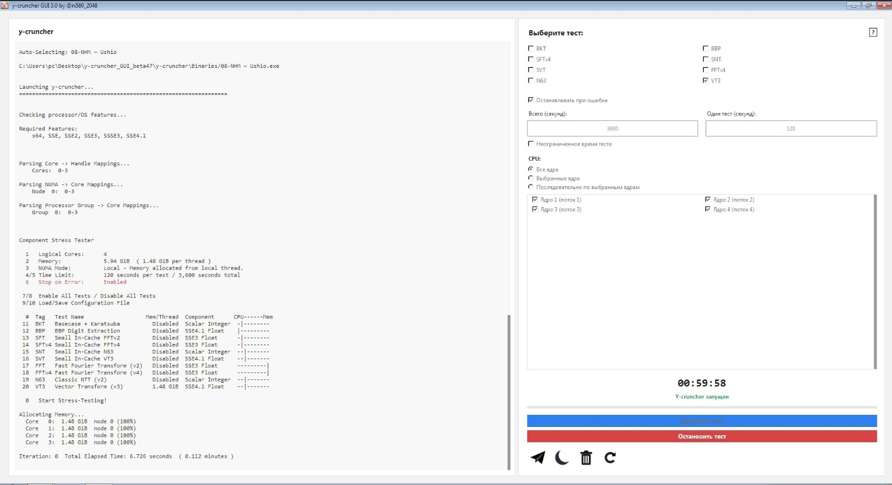

# Y-cruncher GUI by @rx580_2048

## О проекте

За основу взят:

- **y-cruncher 0.8.7** — для Windows 10
- **y-cruncher 0.8.5** — для Windows 7

Все исходники проекта доступны в репозитории.

Если вы не доверяете готовым `.exe`-файлам, можетее самостоятельно собрать программу из исходного кода.

## Скачать

Готовые версии программы находятся в разделе **Releases**:

https://github.com/Bencher2048/Y-cruncher-GUI/releases/

## Telegram

Мой Telegram-канал:

https://t.me/overkloking

---

**Y-cruncher GUI by @rx580_2048**
